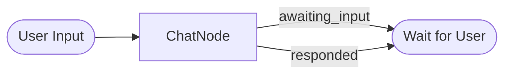

# Chat Example

Simple conversational flow demonstrating ClearFlow's explicit routing for language model interactions.

## Flow



## Quick Start

```bash
# 1. Set up your OpenAI API key
cp ../../.env.example ../../.env
# Edit .env and add your API key

# 2. Install dependencies (from project root)
uv sync --all-extras

# 3. Run the example
uv run python main.py
```

## How It Works

This example demonstrates a single-node flow where the `ChatNode` handles OpenAI API calls and conversation state management. The node returns explicit outcomes:

- `awaiting_input` - When waiting for user input
- `responded` - After generating an AI response

The separation ensures UI logic (looping, input/output) stays in `main.py`, while business logic (LLM calls, state management) stays in the node.

## Key Features

- **Single-node flow** - Simplest possible ClearFlow pattern
- **Explicit outcomes** - Clear distinction between waiting and responding states
- **State management** - Immutable conversation history tracking
- **Clean separation** - UI logic separate from business logic

## Files

- `main.py` - UI handling and conversation loop
- `nodes.py` - ChatNode with OpenAI integration
- `chat_flow.py` - Single-node flow definition