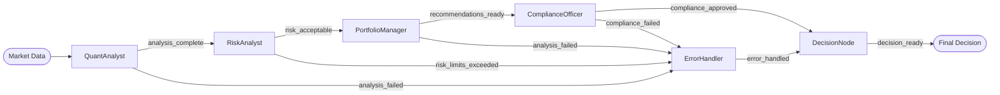

# Portfolio Analysis Workflow Example

*Educational example using simulated market data.*

## Overview

This example demonstrates a **multi-specialist workflow** analyzing market conditions to make portfolio allocation decisions. Each node represents a specialized analysis stage with domain-specific reasoning capabilities.

## Flow Structure



## Educational Value

Demonstrates workflow orchestration patterns that could be adapted for financial applications:

- **Multi-specialist workflow** - Specialized processors with distinct roles
- **Type-safe workflows** - Precise data flow between analysis stages  
- **Risk assessment patterns** - Example checks in decision workflows
- **Compliance patterns** - Example validation steps
- **Audit trail** - Clear reasoning chain for transparency

## Workflow Specialists

Each specialist node uses language model intelligence for domain-specific financial analysis:

### 1. **QuantAnalyst**

- Analyzes market trends and technical indicators
- Calculates momentum, volatility, and correlation metrics
- Identifies investment opportunities with confidence scores

### 2. **RiskAnalyst**

- Performs stress testing and scenario analysis
- Calculates Value-at-Risk (VaR) and exposure limits
- Assesses portfolio concentration and correlation risks

### 3. **PortfolioManager**

- Synthesizes quantitative and risk analysis
- Makes strategic allocation decisions based on investment thesis
- Balances returns, risk, and client objectives

### 4. **ComplianceOfficer**

- Reviews proposed trades against regulatory requirements
- Validates position limits and client mandates
- Ensures adherence to investment policies

### 5. **DecisionNode**

- Synthesizes all analyses into final trading decision
- Creates structured execution plan with monitoring requirements
- Maintains complete audit trail for compliance

### 6. **ErrorHandler**

- Converts any analysis errors into conservative hold decisions
- Ensures workflow always produces a valid trading decision
- Provides detailed error context for debugging

## Setup

```bash
# From project root
uv sync --all-extras
export OPENAI_API_KEY="your-key"
```

## Usage

```bash
# From examples/portfolio_analysis directory
uv run python main.py
```

The educational demonstration will:

1. Generate simulated market data with fictional tickers
2. Run example quantitative analysis
3. Perform example risk assessment
4. Generate example allocation recommendations
5. Demonstrate validation patterns
6. Display the complete example workflow

**Specialist Outcomes:**

- `QuantAnalyst`: analysis_complete / analysis_failed
- `RiskAnalyst`: risk_acceptable / risk_limits_exceeded  
- `PortfolioManager`: recommendations_ready / analysis_failed
- `ComplianceOfficer`: compliance_approved / compliance_failed
- `ErrorHandler`: error_handled
- `DecisionNode`: decision_ready (→ End)

## Key Features

- **Sequential processing** - Each specialist processes data in sequence
- **Type-safe transformations** - `MarketData → QuantInsights → RiskAssessment → Recommendations → Compliance → Decision`
- **Error handling** - Example recovery patterns
- **Validation patterns** - Demonstrates validation approaches
- **Educational workflow** - Learn orchestration patterns

## Customization

- **Market Data**: Modify `market_data.py` to simulate different market conditions
- **Risk Limits**: Adjust parameters in `RiskAnalyst` node
- **Investment Strategy**: Update logic in `PortfolioManager` node  
- **Compliance Rules**: Configure policies in `ComplianceOfficer` node

This example demonstrates how ClearFlow orchestrates **specialist workflows** following the Workflow design pattern, not the Agent pattern. Each specialist is a specialized processor, not an autonomous agent.
