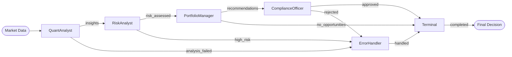

# Portfolio Analysis Example (Educational)

**DISCLAIMER**: This is an educational example using simulated data with fictional tickers.
Not for actual investment decisions. This is not investment advice.

## Overview

This educational example demonstrates **multiple AI agents** working together to analyze simulated market conditions and make example portfolio allocation decisions. Each node represents a different analysis stage with specialized reasoning capabilities.

**All data is simulated. Ticker symbols are fictional. For educational purposes only.**

## Educational Value

Demonstrates workflow orchestration patterns that could be adapted for financial applications:

- **Multi-agent coordination** - Different AI agents with distinct roles
- **Type-safe workflows** - Precise data flow between analysis stages  
- **Risk assessment patterns** - Example checks in decision workflows
- **Compliance patterns** - Example validation steps
- **Audit trail** - Clear reasoning chain for transparency

## AI Team Members

Each node uses language model intelligence for specialized financial reasoning:

### 1. **QuantAnalyst**

- Analyzes market trends and technical indicators
- Calculates momentum, volatility, and correlation metrics
- Identifies investment opportunities with confidence scores

### 2. **RiskAnalyst**

- Performs stress testing and scenario analysis
- Calculates Value-at-Risk (VaR) and exposure limits
- Assesses portfolio concentration and correlation risks

### 3. **PortfolioManager**

- Synthesizes quantitative and risk analysis
- Makes strategic allocation decisions based on investment thesis
- Balances returns, risk, and client objectives

### 4. **ComplianceOfficer**

- Reviews proposed trades against regulatory requirements
- Validates position limits and client mandates
- Ensures adherence to investment policies

## Setup

```bash
pip install -r requirements.txt
export OPENAI_API_KEY="your-key"
```

## Usage

```bash
python main.py
```

The educational demonstration will:

1. Generate simulated market data with fictional tickers
2. Run example quantitative analysis
3. Perform example risk assessment
4. Generate example allocation recommendations
5. Demonstrate validation patterns
6. Display the complete example workflow

## Flow Structure



**Node Outcomes:**

- `QuantAnalyst`: insights/analysis_failed
- `RiskAnalyst`: risk_assessed/high_risk  
- `PortfolioManager`: recommendations/no_opportunities
- `ComplianceOfficer`: approved/rejected
- `ErrorHandler`: handled
- `Terminal`: completed (→ End)

## Key Features

- **Multiple LM calls** - Each stage uses AI reasoning
- **Type-safe transformations** - `MarketData → QuantInsights → RiskAssessment → Recommendations → Compliance → Decision`
- **Error handling** - Example recovery patterns
- **Validation patterns** - Demonstrates validation approaches
- **Educational workflow** - Learn orchestration patterns

## Example Output

```text
📚 EDUCATIONAL PORTFOLIO ANALYSIS EXAMPLE
════════════════════════════════
⚠️ Using simulated data with fictional tickers

📊 Example Analysis (TECH-01, FIN-01, etc.):
• Simulated momentum: Example bullish trend
• Simulated volatility: Example elevated levels  
• Example opportunities: Demonstration only

⚠️ Example Risk Assessment:
• Example VaR calculation: Simulated values
• Example concentration: Demonstration only
• Example correlation: Educational purposes

🎯 Example Recommendations:
• Example: Adjust TECH-01 allocation
• Example: Consider UTIL-01 positions
• Example: Review ENRG-01 exposure

✅ Example Validation:
• Demonstration of validation steps
• Example limit checks
• Example criteria review

💼 Example Output: DEMONSTRATION COMPLETE
• Educational example only
• Not investment advice
• All data simulated
```

## Customization

- **Market Data**: Modify `market_data.py` to simulate different market conditions
- **Risk Limits**: Adjust parameters in `RiskAnalyst` node
- **Investment Strategy**: Update logic in `PortfolioManager` node  
- **Compliance Rules**: Configure policies in `ComplianceOfficer` node

This educational example demonstrates how ClearFlow orchestrates **AI workflows** that could be adapted for various applications. All data is simulated with fictional tickers for educational purposes only.
